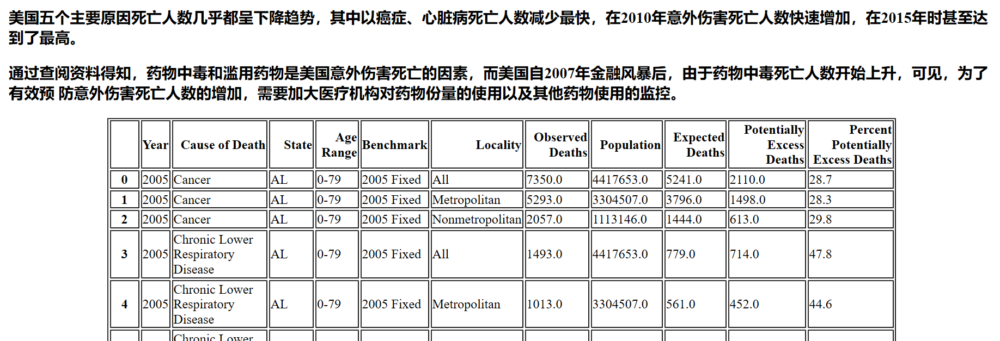
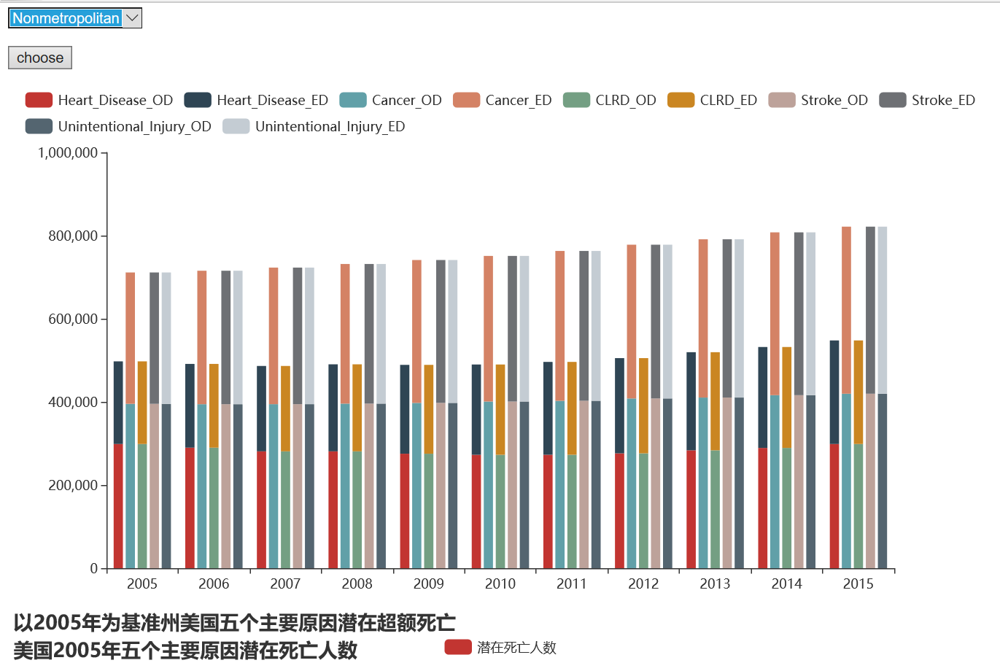
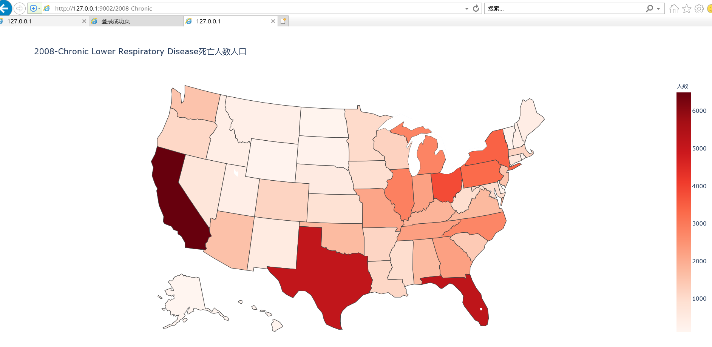

# python作业

文件分为两个

1、IVfinal [部署到pythonanywhere](http://hhh555.pythonanywhere.com/)

针对数据及数据故事所制作的可视化图表。共提供三份数据然后根据选择想要了解的选项把首页3组不同的数据表转换为可视化图表。

#### 使用步骤

（1）首先首页会有3组数据可以选择

（2）每一组的首页之下是每组的数据列表

（3）点击选择该列表之中想要了解的项目

（4）就可以得到可视化的图表了

2、IV（测试版本）

想要尝试把可以化图表显示出来

## 使用数据

- American_cancer_deaths

- cancer_deaths

- NCHS_-_Potentially_Excess_Deaths_from_the_Five_Leading_Causes_of_Death

- Potentially_Excess_Deaths_from_the_Five_Leading_Causes_of_Death_2005_Fixed

## 数据故事展现

以2005年基准州为标准，美国都市和非都市五个主要原因潜在死亡情况。以美国这个为中心,在快速发展经济的同时,重视生态环境问题。然而,由于经济能力有限,技术、经验不足，难以平衡生态环境和经济发展。随着经济的发展、人口的增加,生态环境问题尤为凸显,资源与环境的矛盾日益尖锐。探索未来长期可持续发展道路发展方向尤为重要。

## 项目故事

美国2005-2015年城乡五个主要原因潜在死亡情况
美国2005-2015年各州五个主要原因潜在死亡人数的区域分布情况，美国东部和南部潜在死亡人数远高于其他地方。
而中部较少，随着时间的推移，癌症死亡人数几乎均呈下降趋势，而肯塔基州和田纳西州在2015年几乎达到最高。
慢性呼吸道疾病死亡人数随着时间的推移几乎呈现下降，但是2010年开始美国东南部地区却呈上升趋势
中风的地区是东南和新墨西哥州，德克萨斯州，俄克拉荷马州，阿肯色州和路易斯安那州，由于心脏病和
中风而导致的潜在超额死亡人数的城乡差异几乎消失了。吸烟会增加患心脏病，中风和CLRD并死亡的风险。在
美国，吸烟是可预防的疾病和死亡的主要原因，并且是CLRD的最实质性危险因素。

